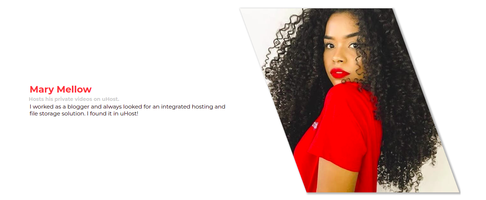

<h1 align="center">uHost Website</h1>

<h2 align="center">Project made using CSS</h2>

  

  Classes here:
  <a href="https://www.udemy.com/course/css-the-complete-guide-incl-flexbox-grid-sass/" target="_blank>
    Advanced CSS and Sass: Flexbox, Grid, Animations and More!
  </a>

\

\

\

\

\

\

\

\

\

\

